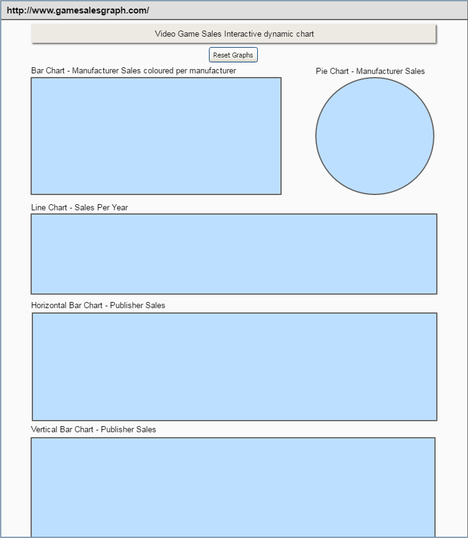

Stream 2 project to plot Video game sales. 

Live link: 
https://stream2-dashboard.herokuapp.com/
 
  
The purpose of the project is to reflect the popularity of game sales using the top five home console manufacturers. 
It will show how popular particular styles of games are and which manufacturer is best at making these types of game. 
From the dataset, I suspect that the downturn in game sales is a matter of online download sales taking over, in combination with the rise in price of video games in general. 

All graphs will change dynamically wit each other, and a reset has been included at the top of the page. 
Mobile first design is not a requirement for this project, but Bootstrap has been used to place graphs relative to each other 
* A Pie chart has been included as it is a requirement but I have also included an equivalent Bar chart with standardised colouring per manufacturer so either can be used to adjust the filters. 
* I opted for a vertical bar chart for the Publishers list and restricted it to display only the top 100, as there were too many, and a lot had no data. 
* I decided to use a horizontal line chart to demonstrate the sales data of video games per year. 
* An additional Bar chart was added to allow users to filter data by Genre, which shows some interesting information. 

Testing 
MAnual testing - Single page so I just did a check that the graphs all respond with each other. The reset Button also works, and the charts are all coloured as expected. 

Mockup 
* Initial mockup for mobile and tablet devices: 

Data cleaning: 
* Restricted data to manufacturers Sega, Nintendo, Sony Mocrosoft, and NeoGeo as other data was present but blank.
* Searched for misssing data online and populated as much as possible from other sources (release dates and publishers).
* Shortened publishers names and combined sub entities to shorten the list.
* Created manufacturer column from console name fields.
* Removed sales less than 10,000 units, as the source data did not contain sales data for older consoles.

Tools used: 
* DC
* D3
* Python3
* MongoDB
* Flask
* Javascript
* HTML5
* CSS3
* GitHub
* Heroku
* Jinja2
* Gunicorn
* Bootstrap
